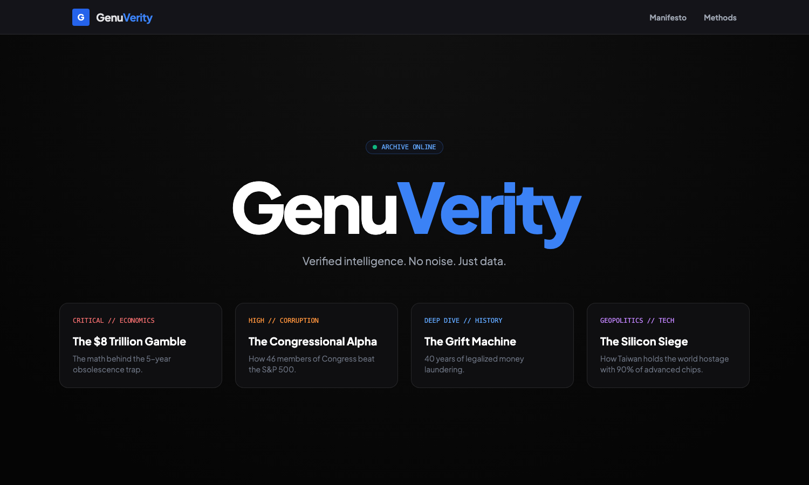

# GenuVerity

  

## Fact Checking Traced to Primary Sources

**GenuVerity** is a comprehensive investigative fact-checking platform that provides credibility scores and traces claims back to primary sources. Truth is now.

### Features

- **Investigative Reports** - In-depth analysis of trending claims and misinformation
- **Credibility Scoring** - Visual credibility meters showing claim accuracy (0-100%)
- **Category Organization** - Browse by topic:
  - Health & Science
  - AI & Deepfakes
  - Corporate & Finance
  - Politics & Policy
- **Search Functionality** - Search across 190+ investigative reports
- **News Feed** - Latest fact-checks and investigations
- **Labs** - Experimental verification tools
- **Transparency** - Open methodology and source citations

### Report Examples

- "Wellness Grifting: The $6.3 Trillion Industry Built on Pseudoscience"
- "The Caracas Mirage: AI-Generated Images Fuel Disinformation"
- "The FireAid Laundering Complex: Wildfire Charity Funds Falsely..."

### Tech Stack

- HTML/CSS/JavaScript
- Dark theme UI with glassmorphism elements
- Responsive carousel for report browsing
- Search and filtering system

### Live Demo

[genuverity.com](https://genuverity.com)

---

*Because truth matters. Every claim. Every source. Verified.*
